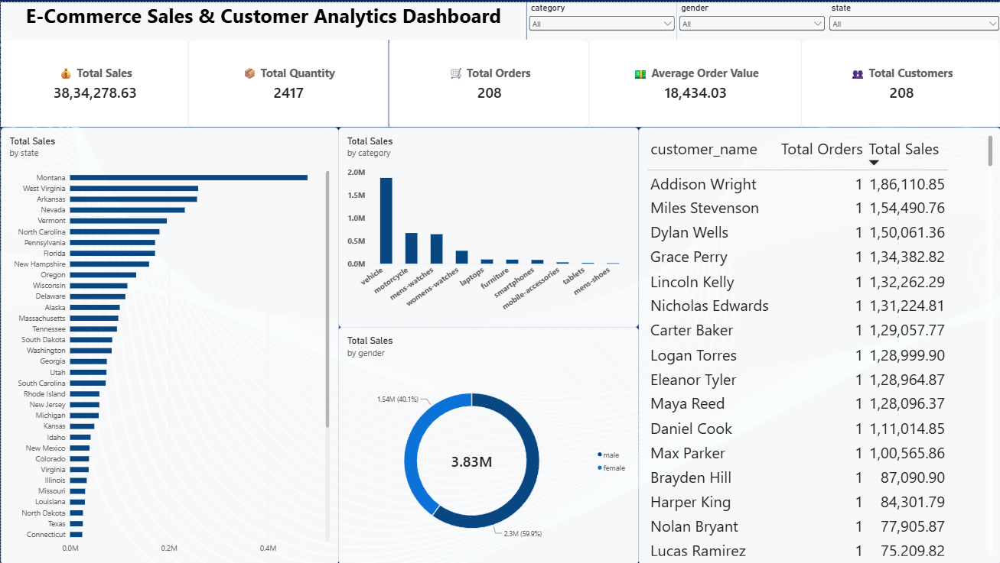

# 🛒 E-Commerce Sales & Customer Analytics Pipeline

An end-to-end Data Analytics ETL project that extracts e-commerce data from live REST APIs, transforms the data using Python and Pandas, loads it into a MySQL Star Schema, and connects the data model to Power BI for interactive business analytics.

---

## 📌 Project Overview

This project demonstrates a complete data analytics workflow from data extraction to business reporting.

### Workflow

**Live REST APIs → Python ETL → MySQL Star Schema → Power BI → Business Insights**

The pipeline extracts product, customer, and sales data from multiple REST API endpoints, transforms the raw JSON data into structured datasets, stores the data in MySQL, and uses Power BI to create an interactive one-page analytics dashboard.

---

## 🏗️ Project Architecture

```text
┌─────────────────────────────┐
│       DummyJSON APIs        │
│                             │
│  Products | Users | Carts   │
└──────────────┬──────────────┘
               │
               ▼
┌─────────────────────────────┐
│       Python Extraction     │
│                             │
│  Requests + REST APIs       │
└──────────────┬──────────────┘
               │
               ▼
┌─────────────────────────────┐
│      Data Transformation    │
│                             │
│  Pandas                     │
│  Cleaning                   │
│  Restructuring              │
│  Data Preparation            │
└──────────────┬──────────────┘
               │
               ▼
┌─────────────────────────────┐
│            MySQL            │
│                             │
│        Star Schema          │
│                             │
│  dim_product                │
│  dim_customer               │
│  fact_sales                 │
└──────────────┬──────────────┘
               │
               ▼
┌─────────────────────────────┐
│          Power BI           │
│                             │
│  Data Model + DAX           │
│  KPIs + Interactive Charts  │
│  One-Page Dashboard         │
└─────────────────────────────┘

---

## 📊 Power BI Dashboard

The project includes an interactive one-page Power BI dashboard for analyzing e-commerce sales and customer performance.

### Dashboard Preview



### Key KPIs

- Total Sales
- Total Quantity
- Total Orders
- Average Order Value
- Total Customers

### Visualizations

- Sales by Category
- Top 10 Products by Sales
- Sales by Gender
- Sales by State
- Top Customers by Sales and Orders

### Interactive Filters

- Category
- Gender
- State